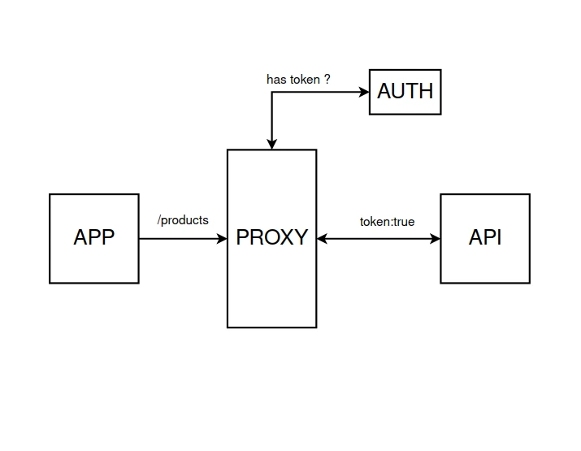

<h1 align="center">
  
 <br>
    PMI Test case
</h1>

<p align="center">
  <a href="https://react.dev/">
    
  </a>
  <a href="https://styled-components.com/">
    
  </a>
  <a href="https://redux.js.org/">
    
  </a>
  <a href="https://storybook.js.org/">
    
  </a>
  <a href="https://vitejs.dev/">
    
  </a>
  <a href="https://swc.rs/">
    
  </a>
  <a href="https://swc.rs/">
    
  </a>
  <a href="https://nestjs.com/">
    
  </a>
  <a href="https://swc.rs/">
    
  </a>
</p>

<p align="center">
  <a href="#how-to-use">Infrastructure</a> |
  <a href="#how-to-use">How To Use</a> 
</p>

## Infrastructure
This infrastructure is using docker containers to isolate applications, it starts each application and runs a proxy (nginx). Each outside request passes trought the proxy and its mapped to its dedicated service, the api is behind an `auth request` so each request done to the api must be authenticated, except `/docs`.
For demo purposes the authentication is getting verified with the current header
```
  Authorization: Bearer veryimportanttoken
```  
In a real app we would use JWT. `Auth Service` has a guard that checks if this header exists, if so, we can assume the user has a valid token and can proceed with its request.

The App has a simple page, that we can create products, this makes a `POST /products` request to the api, if we try to make any request to the api without being "authenticated" we should get `401 Unauthorized`

The Shared UI package provides a sample button, that is used in the App package,
the shared UI is a dependency, so we can import the Button component from the shared ui lib inside the app package.

The Shared UI package uses storybook for UI related components and themes development, docs, and tests.

Developers should be able to import shared ui components to any project.

Both the API and Auth service are using NestJS

App Uses React, React Router, Redux query, and Shared UI lib.

The Objective of this repository is to demonstrate a possible scenario, for isolating any app and have a shared ui lib that can be used by anyone.

The project follows the mono repo pattern, but its actually to faciliate demonstration, the goal is to have each package on its own repository, or by "application domain" (includes app, api).

Auth Service should be always isolated and replicated if necessary for scalability.

<br>


## How To Use
> **Note**
> we use https so please add the following urls to your hosts files:
```bash
# Edit hosts file
$ sudo nano /etc/hosts

# Add the following
127.0.0.1 app.pmi.local
127.0.0.1 api.pmi.local
127.0.0.1 auth.pmi.local
```

```bash
# Clone this repository
$ git clone git@github.com:GoncaloHit/pmi-case.git

# Install dependencies
$ yarn

# Build shared components so we can use on other projects
$ yarn ui:build

# After Building the UI package, we have to update it in other packages that use it
$ yarn --check-files

# If the above command fails some how (app doesnt run)
$ rm yarn.lock
$ yarn

# Run the infrastructure (auth, api, proxy, app)
$ docker-compose up

# App available at (if you added to the hosts file)
https://app.pmi.local

## Other Commands
# Run Storybook and develop shared ui components
$ yarn ui:storybook
```
